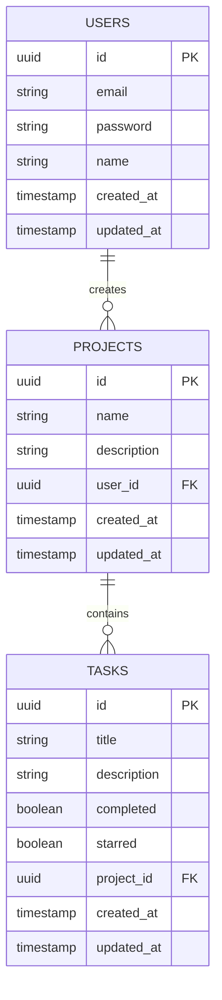

## Fontsource
Font installation is handled with [Fontsource](https://fontsource.org/)

1) Install the font from fontsource
2) Import the font into `theme.js`
3) Apply fonts with `fontfamily="fontName"` attribute, or the sx prop: `sx={{ fontFamily: 'fontName'}}`
4) OR create a custom variant inside `theme.js`:

```js
const theme = createTheme({
  cssVariables: true,
  typography: {
      logoFont: { // Add 'variant=logoFont' to a component
      fontFamily: "Permanent Marker",
    },
  },
  palette: {
    primary: {
      main: '#556cd6',
    },
    secondary: {
      main: '#19857b',
    },
    grey: {
      ...grey,
    },
    error: {
      main: red.A400,
    },
  },
});
```

# Data Model
*To view diagram in vscode, open a preview of this markdown file*
